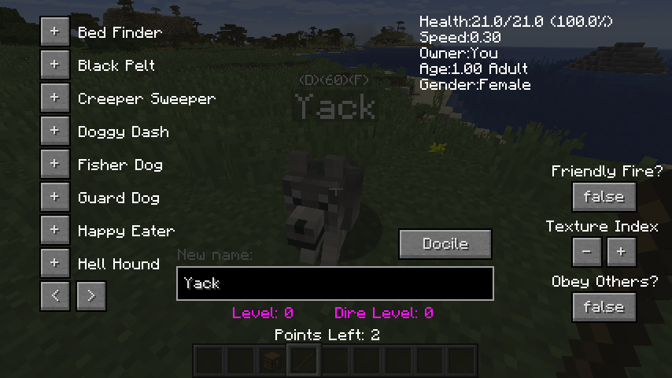
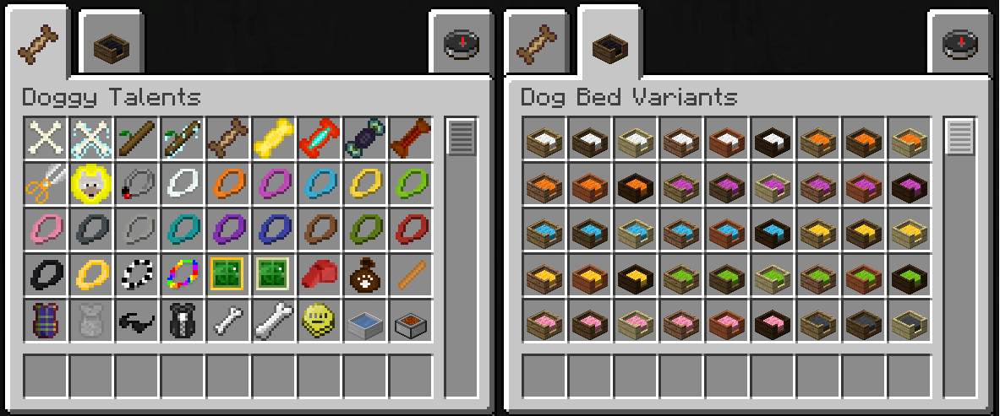
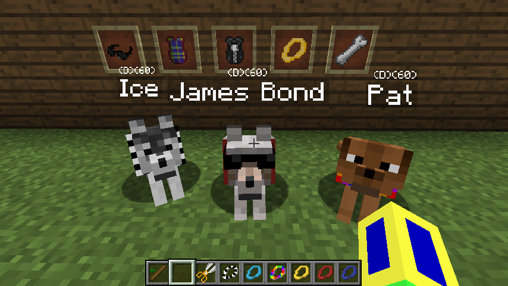
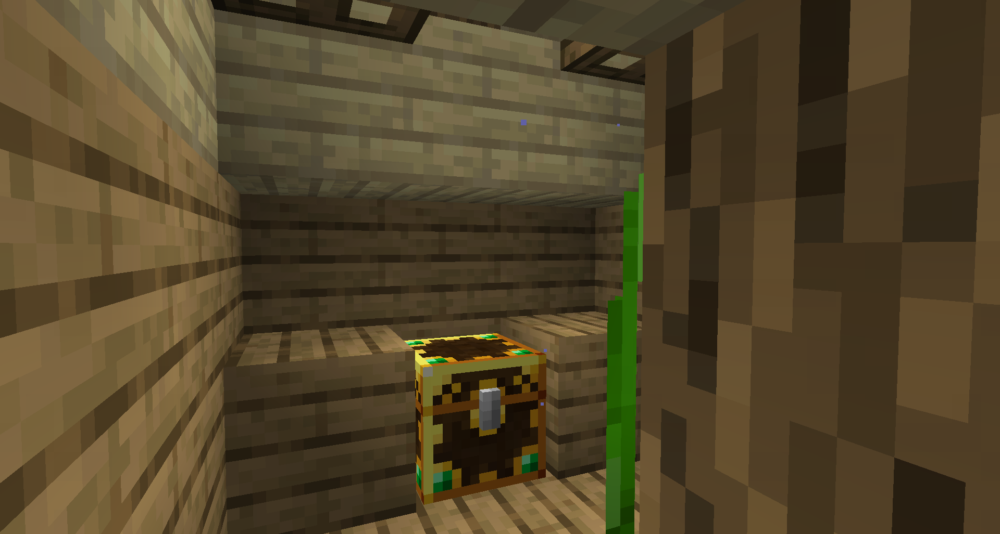
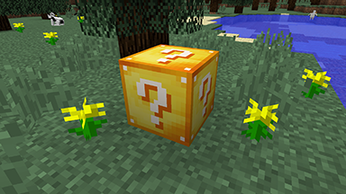
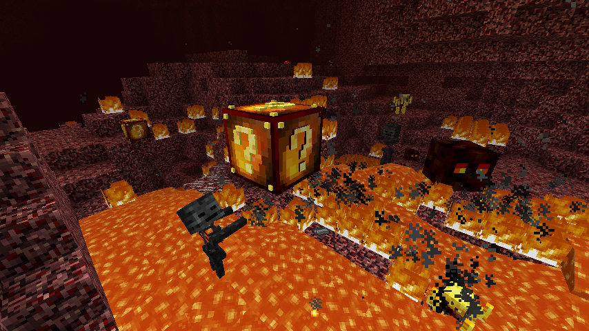
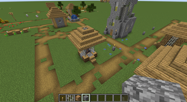
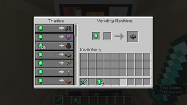
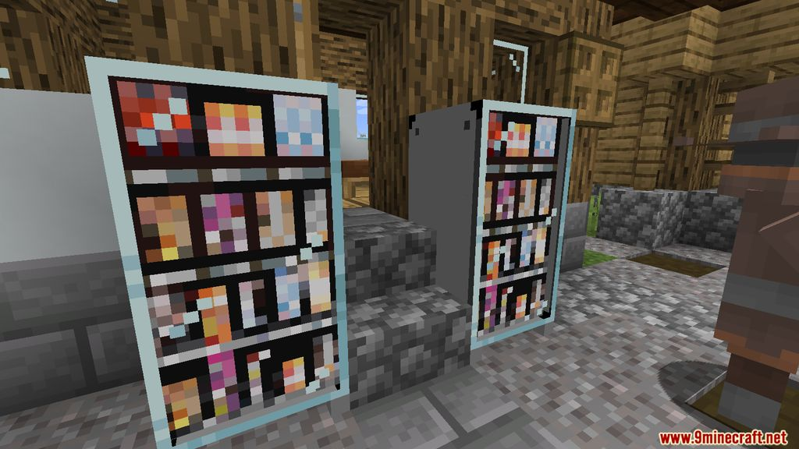
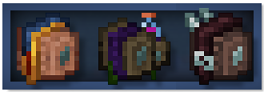

# Getting Started
{: .no_toc }

Some information to help you get started on your adventures.
{: .fs-6 .fw-300 }

## Table of contents
{: .no_toc .text-delta }

1. TOC
{:toc}

---

## Helpful Things

*A few mods which you'll probably want to take advantage of.*

---

### [Doggy Talents](https://www.curseforge.com/minecraft/mc-mods/doggy-talents)

Ever wanted to have a stronger connection with your tamed wolf? Now you can have that!

- 19 unique talents you can give your dog
- Dog leveling system
- Play fetch with your dog
- Dyeable collars and any other fancy collars
- Care for your dog with beds, food bowls etc
- Track your dogs with radio collars on a radar
- Upgraded AI from the wolf
- New hunger system, don't worry about your dog dying unnecessary
- Much more, check out the mod yourself!

#### [Wiki](https://github.com/percivalalb/DoggyTalents/wiki)

**Q: How do I get a dog?**

> Use a training treat on a tamed wolf or in creative mode can use the doggy charm. Use the default *Minecraft* stick to open the dog UI.

**Q: My dog doesn't response to any commands and is stuck on 1 health with a red texture, what do I do!?**

> When a dog hits 0 health it doesn't die instead goes into incapacitated mode where it becomes unresponsive to any interactions. To revive your dog to good health you must feed them a cake.

**Q: How does hunger work?**

> A dog can a maximum of 120 HP (Hunger points) meat will increase their hunger, and happy eater talent will increase amount got from these foods and allow them to eat fish and rotten flesh. As long as they have hunger they will slowly regen health and when a dog is sitting it will slowy regen hunger.

**Q: Are the dog beds and baths just for aesthetic purposes or have functionality?**

> Mainly aesthetic you can put your dog in the bath and it will continuously shake!

---

### [FallingTree](https://www.curseforge.com/minecraft/mc-mods/falling-tree)

Tired of having to chop down the whole tree? Now you can cut down the whole thing by just breaking one log!

---

### [GravelMiner](https://www.curseforge.com/minecraft/mc-mods/gravelminer)

This mod will make your mining trips more enjoyable by getting rid of the falling gravel problem that everyone has run into before.

**Insta-breaks falling gravel when breaking the block below.**

---

### [Lootr](https://www.curseforge.com/minecraft/mc-mods/lootr)

What is Lootr? It's simple: unique inventories for every loot chest for every player on a server.

**What does that mean?** When you open a loot chest (distinctly textured from Vanilla chests), what items you get are unique to you (as though you had opened an Ender Chest). This means no empty chests, and no picking up other people's trash!

**How does this help?** For multiplayer servers, especially those with mods that depend on items looted from chests, it means finding loot closer to home. No more extensive, server-draining trips generating hundreds of chunks in search of a fresh chest.

---

### [Lucky Block](https://www.curseforge.com/minecraft/mc-mods/lucky-block)

The Lucky Block will naturally spawn in your world, and across all dimensions. It's quite rare, though slightly more likely in dimensions such as The Nether. It may also generate within special structures, indicating how positive the outcome is likely to be.

When you open a Lucky Block, it will randomly choose one of over 100 possible outcomes. These cover most components of the game, including items, chests, monsters, structures, potions, enchantments, etc.

#### [More Info](https://www.luckyblockmod.com/info/)

---

### [Packing Tape](https://www.curseforge.com/minecraft/mc-mods/packing-tape)

Ever wanted to move tile entities? Now you can! Packing tape lets you move around chests, machines, spawners, and more without even destroying the inventory of the block you want to move.

**How to use:**

1. Craft the tape with string, paper and slime balls in any crafting grid (shapeless).

2. Right-click with the tape on a block with TileEntity (chests, machines, ...) to pack.

3. Harvest the box to carry it around, and place it in its target location.

4. Right-click on a packed block to unpack.

*Note: Sneaking while placing the block will disable the rotation system while unboxing!*

---

### [Sophisticated Backpacks](https://www.curseforge.com/minecraft/mc-mods/sophisticated-backpacks)

Sophisticated backpacks is yet another backpack mod this time with backpack you can place in world, color in different color combinations, upgrade with more inventory and enhance with many functional upgrades.

**Backpack in its item form**

- Can be accessed using a key press (by default B)
- Renders on player when put in their chest slot
- Curios compatibility makes it possible to wear and render the backpack when put in “Back” slot

**Backpack can also be placed in world**

- Shift right clicking the backpack on the ground puts it down
- When in world player can use it the same way they would use a chest
- Backpacks can also have items piped in/out using hoppers or any kind of modded pipes, external storage access, …
- Shift right clicking the backpack on the ground with empty hand picks it back up or it can also be broken and picked up as any other item
  
**Backpacks can be upgraded**

- 5 tiers - leather, iron, gold, diamond, netherite
- Each of the tiers adds more storage slots and more upgrade slots
  

- *Pickup Upgrade:* Picks up items that match the filter directly into the backpack
- *Magnet Upgrade:* Variant of pickup that teleports items around the player directly into the backpack
- *Filter Upgrade:* Can be used to limit what can be piped into / out of backpack
- *Void Upgrade:* Does exactly what you would expect voids items that are picked up based on its filter
- *Compacting Upgrade:* Compacts items using 2x2 and 3x3 recipes, usually coal, redstone and similar
- *Feeding upgrade:* Feeds player with food from backpack when the player gets hungry
- *Deposit upgrade:* Deposit upgrade makes it so that shift right clicking an inventory with the backpack in hand deposits items specified in upgrades filter into that inventory.
- *Restock Upgrade:* Takes items defined in its filter from inventory shift right clicked with backpack in hand and puts them in backpack.
- *Refill upgrade:* Keeps a stack of item filled in player's inventory
-  *Inception Upgrade:* Allows putting backpacks in backpack
-  *Everlasting Upgrade:* Makes backpack indestructible
-  *Smelting Upgrades:* Portable furnace in backpack which can also work automatically
-  *Crafting Upgrade:* Crafting table in upgrade tab
-  *Stonecutter Upgrade:* Portable version of stonecutter in upgrade tab
- *Stack Upgrade:* Makes it possible to fit more in the inventory slots
-  *Jukebox Upgrade:* Allows to play music discs in upgrade tab
-  *Toolswapper Upgrade:* Automatically swaps tools into player's hand

**Dyeing the backpack in crafting table**

- Color of multiple dyes in recipe gets combined similar to how it works for coloring leather armor except backpack can have two colors - main and accent
- Dyes to the left of the backpack in the recipe apply to the main color
- Dyes to the right apply to the accent color of the backpack
- Dyes in the same column apply to both
- And once dyed you can continue adding dyes which combine with the current main color, accent color or both
- So yes there are many color combinations
- Color of already dyed backpack can be washed away by clicking it on cauldron with water

**Loot / Mob Spawning**

- Occasionally backpacks and some upgrades can be found in loot chests
- And even though rare, mobs can also spawn with backpacks on them sometimes with a bit of loot in those and sometimes they would even play a tune

---

### [Tool Belt](https://www.curseforge.com/minecraft/mc-mods/tool-belt)

Tired of juggling the different tools in your inventory? With a tool belt, it's much easier to manage them!

- Baubles/Curios compatibility! 
- 2 stock slots, upgradeable to 9 by combining with tool pouches in an anvil!
- Quickly switch between tools using the handy Radial Menu! (Hold `R` down -- or change the keybind to your preference)
- It holds any non-stackable item!
- Item Whitelist, for those cases where "non-stackable" isn't enough to decide what can be inserted
- Item Blacklist, for when "any" is too much
- Item Display on Players -- show off your tools at all times! (only the first 2 slots are shown)
- Now with an actual belt!

### [Vending Machines](https://www.curseforge.com/minecraft/mc-mods/vending-machine)

A fun little mod that lets players buy a random set of 7 items from a vending machine.

A random vending machine spawns randomly in Villages! It will contain a random selection of *Minecraft* and modded items each day.

- Common items sell for 1 emerald each. You can buy up to 8 of the same item before it runs out.
- Uncommon items sell for 16 emeralds each. You can buy up to 4 of the same item.
- Rare items sell for 32 emeralds each. You can buy up to 2 of the same item.
- Epic items sell for 64 emeralds. You can buy one item.

### [Wandering Bag](https://www.curseforge.com/minecraft/mc-mods/wandering-bag)

Wandering Bag adds loot bags which are looted by *Minecraft* creatures designated as "intelligent" and having an inventory such as Wandering Traders, Witches and Pillagers. When you get some, you can, with the help of a right click, get relics as surprising as each other until you wonder "Why didn't they use it during the fight?".

### [Waystones](https://www.curseforge.com/minecraft/mc-mods/waystones)

