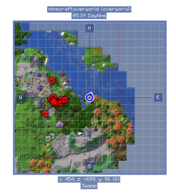

# Introduction
{: .no_toc }

An introduction to new game mechanics.
{: .fs-6 .fw-300 }

## Table of contents
{: .no_toc .text-delta }

1. TOC
{:toc}

---

## Movement

This modpack adds improvements/changes to movement in *Minecraft*.

### [Climb Ladders Faster](https://www.curseforge.com/minecraft/mc-mods/climb-ladders-fast)

Climb ladders much faster than vanilla *Minecraft*. It doesn't have to be tedious.

- Let go of movement keys and look up to go up faster, look down to go down faster.

### [Dashing](https://www.curseforge.com/minecraft/mc-mods/dash)

A dashing mod that adds a new enchant to boots allowing you to dash around. You can obtain a Dashing enchantment book in the same way you can find Frostwalker and Mending books; from chest loot, fishing, raid drops, or trading. This mod is pretty lightweight and is a perfect vanilla+ mod (a mod that fits in with vanilla).

- Once you’ve enchanted your boots with Dashing, press `R` or your assigned keybind of choice to perform a Dash. You can change your keybind for dashing in your controls menu.

### [Going Prone](https://www.curseforge.com/minecraft/mc-mods/goprone)

A simple movement mod which lets the player go into a crawling pose to sneak through 1-block high gaps easily.

- Default keybind is `C` to go prone.

### [Leaping (double jump)](https://www.curseforge.com/minecraft/mc-mods/leap)

Take a leap forward with this simple mod that adds a new enchantment that allows you to double jump! The Leaping enchantment can be obtained just like any other treasure enchantment, being available as loot in chests, fishing, or from the Librarian Villager. It can only be obtained in one level. The enchantment is exclusive to boots. You can use a double jump anytime your motion is moving downward.

- Simply press `space` to do a double jump while you're in the air.

### [Step](https://www.curseforge.com/minecraft/mc-mods/step)

Step up your vanilla experience with this mod that adds a balanced Stepping enchantment that allows you to walk up entire blocks. The stepping enchantment can be obtained similarly to Depth Strider, in an Enchantment Table. It can be obtained at around level 20+, on diamond boots for reference.

- No special movement is required, just walk up blocks.

### [Wall Jumping & Clinging](https://www.curseforge.com/minecraft/mc-mods/wall-jump)

Wall to wall platforming in *Minecraft*! This mod adds wall jumping and double jumping to the game.

- **Wall Cling:** Jump towards a wall and hold the wall jump key `LSHIFT`
- **Wall Jump:** While wall clinging, keep holding `W` and let go of `LSHIFT` to wall jump.

---

## Gameplay

Added/changed gameplay elements intended to improve the *Minecraft* experience.

### [Biome Name Display](https://www.curseforge.com/minecraft/mc-mods/travelers-titles)

Biome names are added as a simple client-side mod that adds RPG-like titles when entering biomes or dimensions.

*Supports all biomes & dimensions.*

---

### [Client Tweaks](https://www.curseforge.com/minecraft/mc-mods/client-tweaks)

This mod adds a bunch of optional tweaks to improve the Quality of Life during gameplay. Tweaks can be individually enabled or disabled and configured. Many of the tweaks are disabled by default, so make sure to enable the features you want for the most bestest experience possible.

#### No Offhand Torch With Block

- This option will refuse to place a torch if you're holding a block in your main hand. Because there's no way you intended to place a torch in that case. Something was just standing in the way of the spot you wanted to place that block in but the torch was fitting since it's smaller. Fixed it for ya.

#### No Offhand Torch With Empty Hand

- You know that feeling when you're tired, try to open the chest but misclicked the block next to it? And of course you still had a torch in your offhand. And of course it placed it. And now you have to break it again. Ugh. This option only allows torches to be placed when your main hand is not empty. This can be enabled additionally to the above.

#### Offhand Torch With Tools Only

- This is the option I consider best, but it changes vanilla behaviour too much to be the default. This will only allow placing torches from the offhand when you're holding a tool. No more accidental torch placement, ever again.

#### Do Not Use Last Torch

- This option is useful when using dynamic lights such as OptiFine. The last torch in your offhand will not be placeable, so you always have a light to carry around with you secured.

#### Hide Own Effect Particles

- This option will make your own potion effect particles a lot less obtrusive for your client. Other players will see them normally. No more annoying particles blocking your view.

#### Hide Offhand Item

- Will prevent the item in your offhand from rendering, in case you hate seeing the torch you're carrying on the left. This can be toggled by a keybind too, in case you only hate seeing your offhand item sometimes.

#### Hide Shield Unless Holding Weapon

- Will prevent shields from being rendered in your offhand unless you're holding a weapon. Specifically, it needs to be a sword or an axe with an attack damage value greater than 1.5 hearts. No, that wooden stick you're holding isn't a weapon.

#### Auto Climb Ladder

- I often make really long ladders down to my mine, and it's a pain having to hold down a key the whole time while climbing back up. With this tweak on, you will continue to climb upwards as long as you look upwards while on a ladder. That means you can type in chat and do other things without instantly falling back down and losing all of your progress on the long journey.

#### Disable Potion Shift

- Prevents the inventory from being shifted to the right when potion effects are active. You probably never noticed because NEI did it in 1.7.10 and now Quark does it in 1.10.2 and then there's also a mod called No Potion Shift that does it, but in case you have none of these, you now have this!

#### Toggle Off Step Assist

- There's people who hate step assist, but sometimes those step-assist granting items add some other cool perks that we want. So this option lets you disable the step-assist part only. With optional keybind to toggle.

#### Master Volume Slider in Options Screen

- Yes, the new volume settings screen is cool. But couldn't you have kept the Master Volume slider on the main settings screen as well? After years of research I have concluded that you can, so I added it back. Saved you a click.

#### Music Volume Slider in Options Screen

- Made up user studies have shown that the average player will much more frequently want to turn off the music than change the master volume, so our team of highly experienced quantum programmers have also brought the music slider back to the main settings screen.

---

### [Food](https://www.curseforge.com/minecraft/mc-mods/spice-of-life-carrot-edition)

Slice of Life: Carrot is included to encourage dietary variety! It does so by rewarding the player for eating a variety of foods instead of punishing them for failing to diversify.

The mod keeps track of how many unique foods a player has eaten. As they pass certain milestone amounts of unique foods, they permanently gain new hearts, increasing their max health! In order to max out their HP bars, players will have to quest for and craft exotic foods.

This mod comes with a custom config to set the player's starting hearts (which can be less than 10 if desired) as well as the number of unique foods they need to eat until they reach each milestone. The number of hearts per milestone is also configurable.

The default configuration allows a player to go from 10 to 20 hearts by eating most non-poisonous foods in vanilla *Minecraft*. However, it is mostly designed for modpack authors who want to add Pam's HarvestCraft or other food mods to their modpack, because it adds interest and incentivizes players to explore a complex cooking system. Finally, the niche "chef" players of the *Minecraft* world will have a place of honor next to the miners and engineers!

In order to track your progress, Slice of Life: Carrot offers a handy book called the Food Book, crafted simply by combining a book and a carrot in any shape. This book offers a visualization of your overall progress, as well as lists of the foods you have and have not eaten. (The latter can be disabled in config.)

*This mod also features 3 commands:*

`/foodlist size`

> *Tells you the number of unique foods you've eaten, as well as and how many more you need to eat until your next milestone.*

`/foodlist clear`

> *Clears the stored list of unique foods a player has eaten and resets their heart count. This is useful for testing when editing the config or when you want to start over.*

`/foodlist sync`

> *Forces a sync of the food list to the client, for when something went wrong and it's mismatched.*

---

### [Heart Canisters](https://www.curseforge.com/minecraft/mc-mods/baubley-heart-canisters)

This Mod Brings Back the Old Tinkers Heart Canisters in a new Way. They Go in a Bauble Slot. 

**RED HEARTS** - Drop From Enemy Mobs

**ORANGE HEARTS**- Drop From Boss Mobs (I.E. Wither)

**GREEN HEARTS**- Drop from the Enderdragon

**BLUE HEARTS**- Drop from Envoker inside Woodland Mansion

---

### [Inventory HUD](https://www.curseforge.com/minecraft/mc-mods/inventory-hud-forge)

This mod contains a few features, first of all - Inventory HUD, it shows your inventory while you are playing, you can switch between mods (mini/normal and horizontal/vertical), also you can change background transparency and toggle animation on/off.

Next feature is PotionHUD, it shows your potion effects with timer or duration bar if you are using mini mode, you can change gap between effects and background transparency in config, and you can enable horizontal mode as well.

And last but not least feature is ArmorHUD, it shows durability of your armor and equipment, also shows how many free slots do you have in your inventory and how many arrows do you have. This HUD is fully customizable, you can change scale, type of damage indicator or turn on/off each part of your equipment.

You can change a lot of options in config ("Mod" button in Main Menu, then "Config"), also you can change the position for each HUD by simply dragging and dropping them. To open in-game config screen you can use keybind ("O" by default).

---

### [Inventory Sorting](https://www.curseforge.com/minecraft/mc-mods/inventory-profiles-next)

Cluttered inventories be no more! Inventory sorting is a part of this modpack along with tweaks to make moving items easier.

- Keep your inventory sorted
- Replace your quasi-broken tool
- Dump everything in that chest with one click
- Move the items you have that are also already in the chest
- Lock item slots in place so that sorting ignores them
- Keep locked slots empty
- Allow you to press `R + C` to set your shortcuts
- Middle mouse click sorts
- Mousewheel in and out of inventory one item at a time

---

### [Mini Map/World Map](https://www.curseforge.com/minecraft/mc-mods/journeymap)

Your world is mapped as you explore and is displayed in the top right of your screen. (This placement can be changed.) Additionally, it provides your current coordinates, the biome you're in, the world name, and the current time in-game.

- A full-screen map is available using `M`
- Add waypoints to your map using `B` to keep track of locations in any dimension.
- Claim chunks and keep chunks loaded from the full-screen map.

---

### [Mouse Tweaks](https://www.curseforge.com/minecraft/mc-mods/mouse-tweaks)

Tweaks are included for mouse actions to improve quality of life and make tasks less tedious.

*Configuration found at: `/config/MouseTweaks.cfg`*

#### Right Mouse Button (RMB, Holding Item)

> Very similar to the standard RMB dragging mechanic, with one difference: if you drag over a slot multiple times, an item will be put there multiple times. Replaces the standard mechanic if enabled.

#### Left Mouse Button (LMB, Holding Item)

>Lets you quickly pick up or move items of the same type. Hold your left mouse button to pick up an item, drag your mouse across the inventory. Items of the same type will be picked up, hold `shift` and drag. Items of the same type will get "`shift`-clicked":

#### Left Mouse Button (LMB, Without Item)

> Quickly move items into another inventory. Hold shift, then hold your left mouse button, drag your mouse across the inventory. Items will get "shift-clicked".

#### Wheel Tweak

> Scroll to quickly move items between inventories. When you scroll down on an item stack, its items will be moved one by one. When you scroll up, items will be moved into it from another inventory.

---
